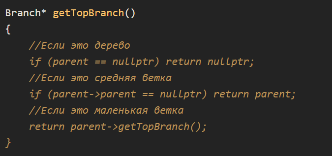
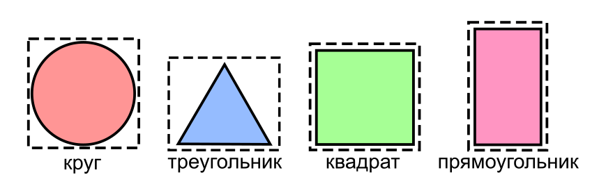

# **27.4 Практическая работа**

### **Задача**

### Цели практической работы

Получить первичный практический навык работы с классами в C++.
Научиться:
1. создавать и вызывать конструкторы,
2. пользоваться указателем this,
3. выстраивать иерархии классов.

### Что входит в работу

1. Реализовать деревню эльфов.
2. Спроектировать иерархию геометрических фигур.
3. Реализовать симуляцию работы компании.

## **Задание 1. Реализация деревни эльфов**

### Что нужно сделать

Лесные эльфы расположили свою деревню в лесу, прямо на деревьях. Нужно расселить эльфов по веткам деревьев, 
а затем подсчитать общее количество соседей определённого эльфа.

Всего в лесу пять деревьев, каждое из которых генерируется с помощью случайных чисел, заданных в указанных 
далее диапазонах. На каждом дереве есть 3–5 основных больших ветвей. На каждой большой ветке расположены 
ещё 2-3 средние ветки. Дома эльфов построены на больших и на средних ветках. 
Более мелкие ветви не рассматриваются в этой задаче.

В начале программы пользователь размещает в каждом доме по одному эльфу. Делается это с помощью последовательного 
перебора всех имеющихся домов и запроса имени заселяемого эльфа через стандартный ввод. Если было введено None в 
качестве имени, то дом пропускается и не заселяется никем.

После этого требуется найти определённого эльфа по имени. Имя искомого эльфа вводится через стандартный ввод. 
Для найденного эльфа нужно вывести общее количество эльфов, живущих вместе с ним на одной большой ветви. 
Это и будет искомое количество соседей.

Советы и рекомендации

И для представления деревьев, и для представления больших и средних ветвей следует использовать один и тот же
класс (например Branch) с полем, которое будет обозначать родительскую ветвь, и полем, обозначающим дочерние ветви.
У самого дерева, в свою очередь, родительская ветвь будет всегда нулевой, то есть nullptr.

Функцию поиска эльфа в дереве можно реализовать с помощью рекурсивного метода в классе Branch, который сначала 
поищет эльфа в себе, а потом уже на дочерних ветвях.

Чтобы лучше представлять структуру дерева и понимать, как получать его вершину, взгляните на данный метод:

Что оценивается
Корректность работы программы и элегантность принимаемых решений.

## **Задание 2.** Иерархия геометрических фигур

### Что нужно сделать

Спроектируйте иерархию классов различных фигур: круг, квадрат, равносторонний треугольник, прямоугольник.

Для всех этих фигур есть общие поля-данные — это координаты их центра и условный цвет фигуры: красный, синий или зелёный.

Для отдельных фигур есть и уникальные параметры: радиус для круга, длина ребра для квадрата и равностороннего треугольника, ширина и высота для прямоугольника. Все данные — это вещественные числа с удвоенной точностью.

Для каждой из фигур требуется определить метод нахождения площади фигуры, а также метод нахождения прямоугольника, описывающего фигуру полностью (он может быть больше зоны фигуры, но не меньше).

Для лучшего понимания задачи приведена иллюстрация. На ней разными цветами помечены площади фигур, а пунктиром изображены прямоугольники, описывающие фигуры.

Для теста предусмотрите ввод пользователем команд: circle, square, triangle, rectangle, соответствующих фигурам. Команды должны получать параметры фигур и выводить их цвет, площадь и описывающий прямоугольник с координатами.

Советы и рекомендации

Для цвета фигуры вы можете использовать собственный тип enum, в котором может содержаться и константа отсутствия цвета — None.

Площадь треугольника считается как length * length * std::sqrt(3) / 4; где length — сторона. Площадь круга — как atan(1) * 4 * radius;

Геометрические формулы вы можете найти в интернете.

Что оценивается

Элегантность выстроенной иерархии классов. Корректность работы методов вычислений для фигур важна, но не столь принципиальна.
